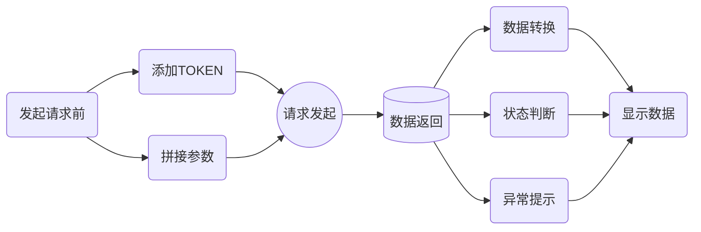
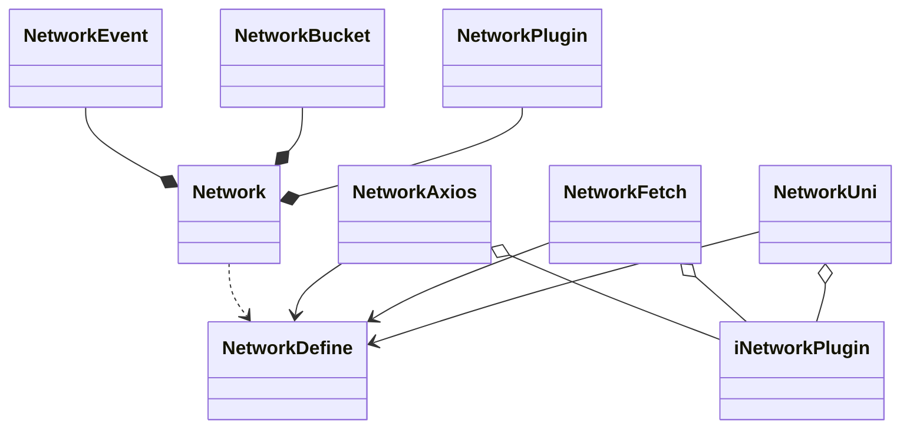

# @wh/network

`@wh/network`是基于前端网络请求全流程需求，结合请求的生命周期，功能插件化接入的一款网络请求管理库。

## 使用

* yarn

```sh
  yarn add @wh/network
```

* npm

```sh
  npm i @wh/network -S
```


* cnpm

```sh
  cnpm i @wh/network -S
```

## 功能

### 生命周期

在请求发起的前后，经常会做一些操作，比如发起前加入token，把参数拼到url中等，得到请求的数据后，也会进行一些操作，如数据转换，成功状态判断、异常提示等。



针对这些常用的时间点，提供了相应的生命周期钩子

```ts
//TODO:生命周期钩子
```

接口定义时使用钩子

```ts
//TODO:生命周期钩子
```

调用接口时使用钩子

```ts
//TODO:生命周期钩子
```

### 管道插件

```ts

```

### 服务注册

```ts

```

### 处理器插件

现在前端请求方案有很多，如Axios、Fetch、XHR等，以及各类平台中的特有，如uniapp，小程序等。为了保证类库的通用性和主体复用性，最后发起请求的处理器使用插件化设计。用户可自定义处理器。

```ts

```

## 类图


